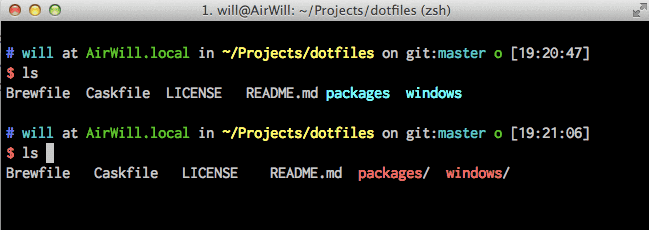

# thibaudcolas’s dotfiles



## How to use the dotfiles

A fully automated installation and update process is described in [Mathias's dotfiles repo](https://github.com/mathiasbynens/dotfiles). I myself prefer to copy/paste files by hand, since it is quite sensible and not that frequent.

### Installing from the repository

Install brew: http://brew.sh/

Here are some useful commands:

~~~bash
    # This may be quite useful when you work with so many dotfiles:
    defaults write com.apple.finder AppleShowAllFiles -bool true

    # Let's make sure we are up to date.
    brew update
    brew upgrade

    # Install all brew packages listed in the Brewfile.
    brew install $(cat Brewfile|grep -v "#")

    # Before playing with brew cask:
    brew install caskroom/cask/brew-cask

    # Install all brew cask packages listed in the Caskfile.
    brew cask install $(cat Caskfile|grep -v "#")

    # Install all packages listed in our packages folder:
    npm install -g $(cat packages/npm-packages.txt)
    gem install $(cat packages/gem-packages.txt)
    pip install $(cat packages/pip-packages.txt)

    # Install atom packages
    apm install --packages-file packages/atom-packages.txt

    # Before installing fonts:
    brew tap caskroom/fonts

    # Install all brew cask fonts listed in the Fontfile.
    brew cask install $(cat Fontfile|grep -v "#")
~~~

### Specify the `$PATH`

If `~/.path` exists, it will be sourced along with the other files, before any feature testing (such as [detecting which version of `ls` is being used](https://github.com/mathiasbynens/dotfiles/blob/aff769fd75225d8f2e481185a71d5e05b76002dc/.aliases#L21-26)) takes place.

Here’s an example `~/.path` file that adds `~/utils` to the `$PATH`:

```bash
export PATH="$HOME/utils:$PATH"
```

### Add custom commands without creating a new fork

If `~/.extra` exists, it will be sourced along with the other files. You can use this to add a few custom commands without the need to fork this entire repository, or to add commands you don’t want to commit to a public repository.

My `~/.extra` looks something like this:

```bash
# Git credentials
# Not in the repository, to prevent people from accidentally committing under my name
GIT_AUTHOR_NAME="Author Name Example"
GIT_COMMITTER_NAME="$GIT_AUTHOR_NAME"
git config --global user.name "$GIT_AUTHOR_NAME"
GIT_AUTHOR_EMAIL="mail@example.com"
GIT_COMMITTER_EMAIL="$GIT_AUTHOR_EMAIL"
git config --global user.email "$GIT_AUTHOR_EMAIL"
```

You could also use `~/.extra` to override settings, functions and aliases from my dotfiles repository. It’s probably better to [fork this repository](https://github.com/thibaudcolas/dotfiles/fork) instead, though.

### Sensible OS X defaults

When setting up a new Mac, you may want to set some sensible OS X defaults:

```bash
./.osx
```

### Other steps

- Install Oh My ZSH
- Install global npm packages
- Install global gem packages
- Install global pip packages

## Adding things to the repository

### Adding packages

- For Brew: `brew list`
- For Brew Cask: `brew cask list`

~~~bash
# Ruby
gem list | cut -d ' ' -f 1 > packages/gem-packages.txt
# Python
pip list | cut -d ' ' -f 1 > packages/pip-packages.txt
# JavaScript
npm list -g --depth=0 | cut -d ' ' -f 2 | cut -d '@' -f 1 > packages/npm-packages.txt
# Atom
apm list --installed --bare > packages/atom-packages.txt
# TODO Sublime
~~~

## Useful links

- http://brew.sh/
- http://brewformulas.org/
- http://caskroom.io/
- https://github.com/caskroom/homebrew-fonts

### Alfred Workflows

- https://github.com/zenorocha/alfred-workflows
- https://github.com/willfarrell/alfred-workflows

## Alternative for Windows

Try a mix of the following:

- https://ninite.com/
- http://boxstarter.org/
- https://chocolatey.org/

## Thanks to

### Original Author

| [](http://twitter.com/mathias "Follow @mathias on Twitter") |
|---|
| [Mathias Bynens](http://mathiasbynens.be/) |

* @ptb and [his _OS X Lion Setup_ repository](https://github.com/ptb/Mac-OS-X-Lion-Setup)
* [Ben Alman](http://benalman.com/) and his [dotfiles repository](https://github.com/cowboy/dotfiles)
* [Chris Gerke](http://www.randomsquared.com/) and his [tutorial on creating an OS X SOE master image](http://chris-gerke.blogspot.com/2012/04/mac-osx-soe-master-image-day-7.html) + [_Insta_ repository](https://github.com/cgerke/Insta)
* [Cãtãlin Mariş](https://github.com/alrra) and his [dotfiles repository](https://github.com/alrra/dotfiles)
* [Gianni Chiappetta](http://gf3.ca/) for sharing his [amazing collection of dotfiles](https://github.com/gf3/dotfiles)
* [Jan Moesen](http://jan.moesen.nu/) and his [ancient `.bash_profile`](https://gist.github.com/1156154) + [shiny _tilde_ repository](https://github.com/janmoesen/tilde)
* [Lauri ‘Lri’ Ranta](http://lri.me/) for sharing [loads of hidden preferences](http://osxnotes.net/defaults.html)
* [Matijs Brinkhuis](http://hotfusion.nl/) and his [dotfiles repository](https://github.com/matijs/dotfiles)
* [Nicolas Gallagher](http://nicolasgallagher.com/) and his [dotfiles repository](https://github.com/necolas/dotfiles)
* [Sindre Sorhus](http://sindresorhus.com/)
* [Tom Ryder](http://blog.sanctum.geek.nz/) and his [dotfiles repository](https://github.com/tejr/dotfiles)
* [Kevin Suttle](http://kevinsuttle.com/) and his [dotfiles repository](https://github.com/kevinSuttle/dotfiles) and [OSXDefaults project](https://github.com/kevinSuttle/OSXDefaults), which aims to provide better documentation for [`~/.osx`](http://mths.be/osx)
* [Haralan Dobrev](http://hkdobrev.com/)

* anyone who [contributed a patch](https://github.com/mathiasbynens/dotfiles/contributors) or [made a helpful suggestion](https://github.com/mathiasbynens/dotfiles/issues)
